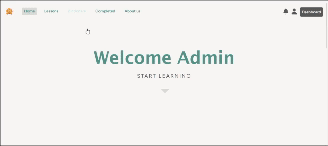
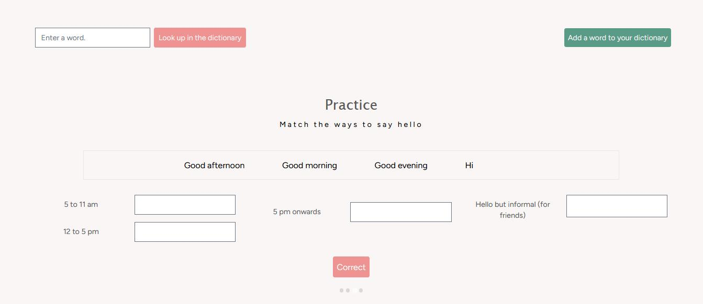
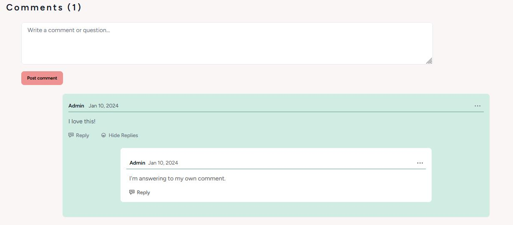
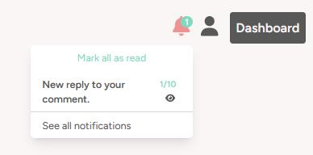
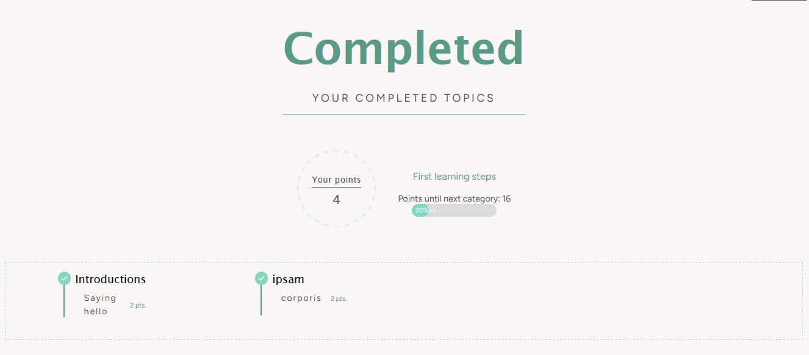
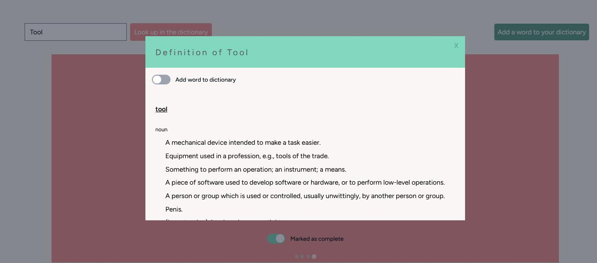
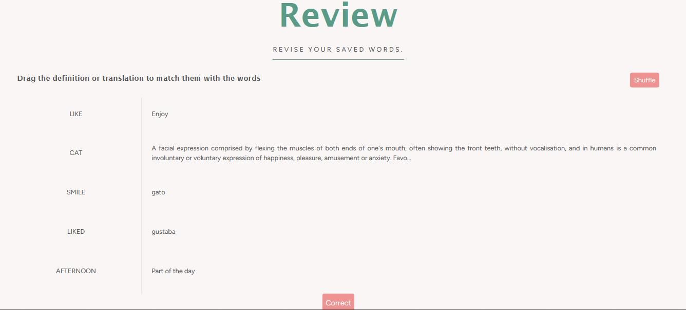
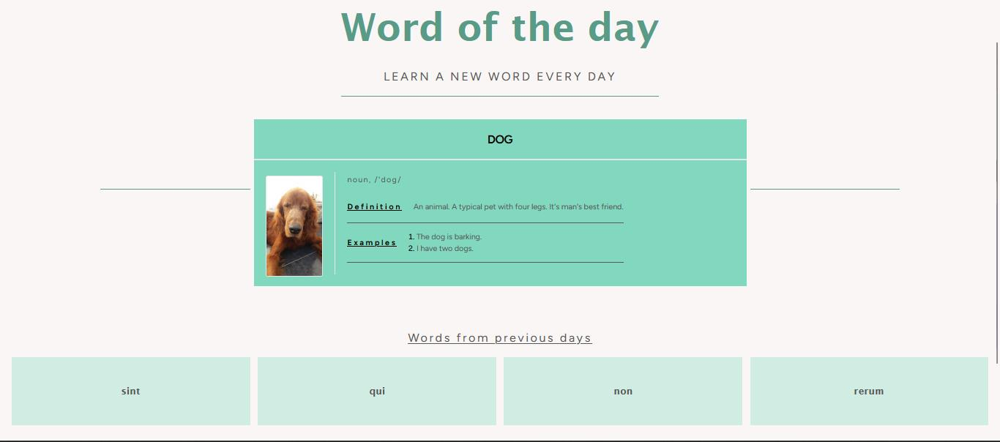

## English-Learning-Platform

It is a Laravel Jetstream (PHP + Vue) project to make English learning and teacher easier. The admin panel is currently set up in Blade, but will be eventually migrated to Vue for more consistency. This project uses Inertia and Tailwinds Css.

## Explanation of the platform:

 The admin can create English lessons (similar to units in a book) according to the Common European Framework of Reference (CEFR) levels A1 to C2. The lessons, in turn, have topics (similar to each page in an unit) and mixed exercises (which combine elements from the different topics for the user to practice). Each topic has slides with either an exercise or an explanation.

The exercises and mixed exercises can be of four types: match, order, fill and select. They are corrected automatically.

The user can choose to start a level from 0, following the path of lessons and topics that the admin determined, or they can choose a topic based on their specific needs.

If they have any questions about the topic, they can leave a comment and interact with other users, as well as teachers, in the comment section. They will be notified when someone answers.

Once the user has finished all the slides in the topic, they can mark the topic as complete, thus earning points.

They can also look up words they don't know in a dictionary, add words to their personalised dictionary and later practice those words in the Review section.

The page also has a "Word of the Day" section with audio and images that the admin can set up.

## Currently working on:

Cleaning up the controllers and making the page more interactive.

